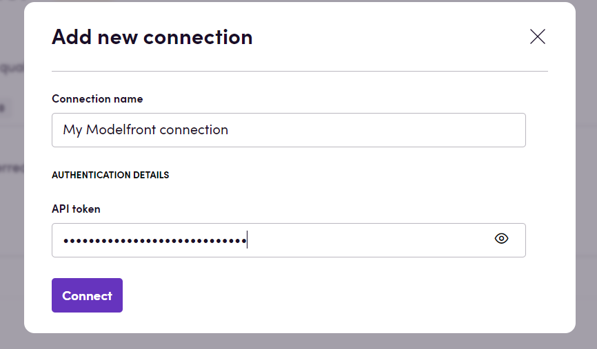
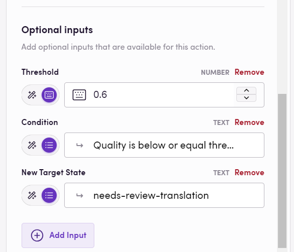

# Blackbird.io Modelfront

Blackbird is the new automation backbone for the language technology industry. Blackbird provides enterprise-scale automation and orchestration with a simple no-code/low-code platform. Blackbird enables ambitious organizations to identify, vet and automate as many processes as possible. Not just localization workflows, but any business and IT process. This repository represents an application that is deployable on Blackbird and usable inside the workflow editor.

## Introduction

<!-- begin docs -->

ModelFront specializes in providing solutions for improving machine translation (MT) quality. Their primary focus is on helping businesses and organizations achieve better translation outputs through their software platform. ModelFront offers services such as data evaluation, model performance monitoring, and quality assessment to ensure that machine translation systems deliver accurate and reliable results. 

## Before setting up

Before you can connect you need to make sure that:

- You have a Modelfront account.
- You have an API token corresponding to your Modelfront account.

## Connecting

1. Navigate to apps and search for Modelfront. If you cannot find Modelfront then click _Add App_ in the top right corner, select Modelfront and add the app to your Blackbird environment.
2. Click _Add Connection_.
3. Name your connection for future reference e.g. 'My Modelfront connection'.
4. Fill in the API token for your Modelfront account.
7. Click _Connect_.

## Actions

- **Predict** Get prediction data for a single segment
- **Predict multiple** Get prediction data for multiple segments
- **Predict XLIFF** Get quality and risk prediction data for all segments in an XLIFF 1.2 file. Mandatory input data include the translated XLIFF file, source and target language values. As an output, Average Quality and Average Risk scores are provided, which are the average of the quality and risk scores for all segments in the file. Additionally, all translation units get appeneded with their individual quality score which is added to the `extradata` attribute in the XLIFF file. Optionally, you can add Threshold, New Target State and Condition input parameters to the Blackbird action to change the target state value of segments meeting the desired criteria.

Examples:

Setting the optional input values as shown in the image below will result in all segments with a quality score above 0.9 to have their target state values updated to "final".

Similarly, the setup below will cause all the segments with a quality score below or equal to 0.6 to have their target state value changed to "needs-review-translation".

## Feedback

Do you want to use this app or do you have feedback on our implementation? Reach out to us using the [established channels](https://www.blackbird.io/) or create an issue.

<!-- end docs -->
